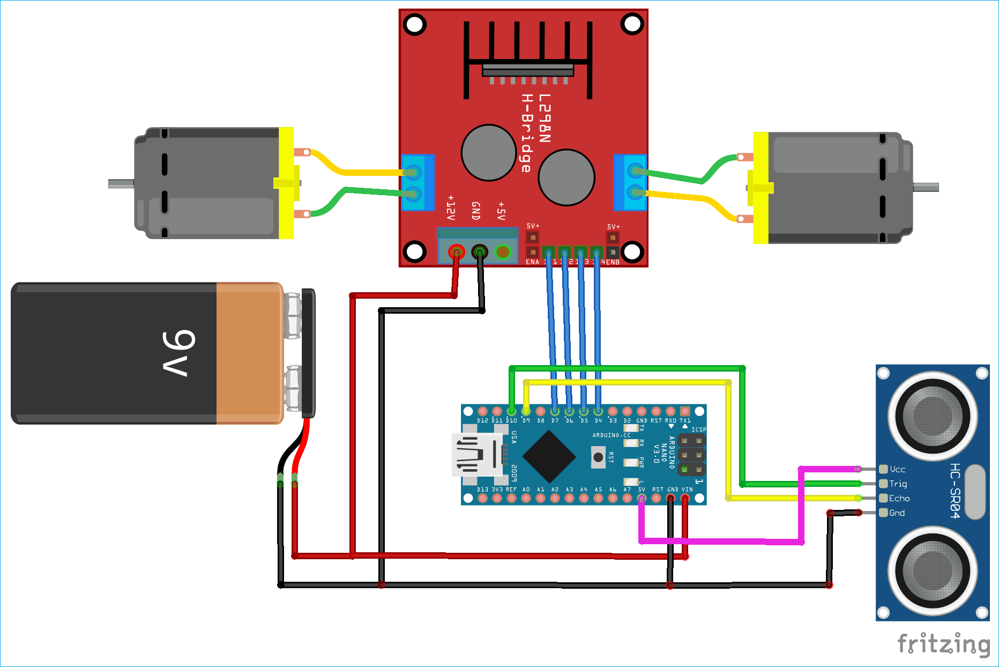

# Obstacle Avoiding Robot

A two-wheel obstacle avoiding robot built with an Arduino Nano, an HC-SR04 ultrasonic sensor and an L298N motor driver. It drives forward, and when it detects an object closer than about 18 cm it stops, backs up, turns and carries on.

> **Status:** Working prototype

## Demo

<!-- Add a photo of your robot here:  -->

## Components

| Component | Qty | Purpose |
|---|---|---|
| Arduino Nano | 1 | Main controller |
| HC-SR04 ultrasonic sensor | 1 | Measures distance to obstacles |
| L298N motor driver | 1 | Drives the two motors |
| DC gear motors | 2 | Drive the left and right wheels |
| 9 V battery | 1 | Power for the motors and the Nano |
| Chassis, wheels, caster, wires | - | Body of the robot |

## Circuit

### Pin connections

| Arduino Nano pin | Connected to |
|---|---|
| D9 | HC-SR04 Trig |
| D10 | HC-SR04 Echo |
| D7 | L298N IN1 (right motor forward) |
| D6 | L298N IN2 (right motor reverse) |
| D5 | L298N IN3 (left motor forward) |
| D4 | L298N IN4 (left motor reverse) |
| 5V | HC-SR04 Vcc |
| GND | HC-SR04 Gnd and battery negative |
| VIN | Battery positive |

The L298N takes power directly from the 9 V battery on its 12 V and GND terminals. The ENA and ENB jumpers are left in place, so the motors always run at full speed.

## How it works

1. The Nano sends a 10 microsecond pulse on the Trig pin.
2. The sensor sends out an ultrasonic burst and the Echo pin stays HIGH until the reflection returns.
3. The code measures that time with `pulseIn()` and converts it to centimetres by dividing by 58.2.
4. The distance decides the motion:

| Distance | Action |
|---|---|
| More than 19 cm | Move forward |
| Less than 18 cm | Stop for 0.5 s, reverse for 0.5 s, stop briefly, then turn for 0.5 s |
| 18 to 19 cm | No change, so the robot keeps doing what it was doing |

The turn is made by running only the right motor forward while the left motor is stopped, so the robot pivots and then goes forward again in a new direction.

The gap between 18 and 19 cm is deliberate. It keeps the robot from switching rapidly between moving and turning when the distance is right on the threshold.

## Code

The full sketch is in [`code/code.ino`](code/code.ino).

To run it:

1. Open the file in the Arduino IDE.
2. Select **Board: Arduino Nano** and the correct processor and port.
3. Upload.
4. Switch on the battery, and the robot starts moving after a short random delay.

## Possible improvements

- Use the ENA and ENB pins with PWM to control motor speed
- Mount the sensor on a servo so the robot can look left and right and pick the clearer direction
- Add a timeout to `pulseIn()` so the robot does not freeze if no echo comes back
- Replace `delay()` with `millis()` timing so the robot keeps reading the sensor while it turns

## Credits

Based on the open-source project [Obstacle-Avoiding-Robot](https://github.com/Awais-Asghar/Obstacle-Avoiding-Robot), which uses the same Arduino Nano, HC-SR04 and L298N design.
